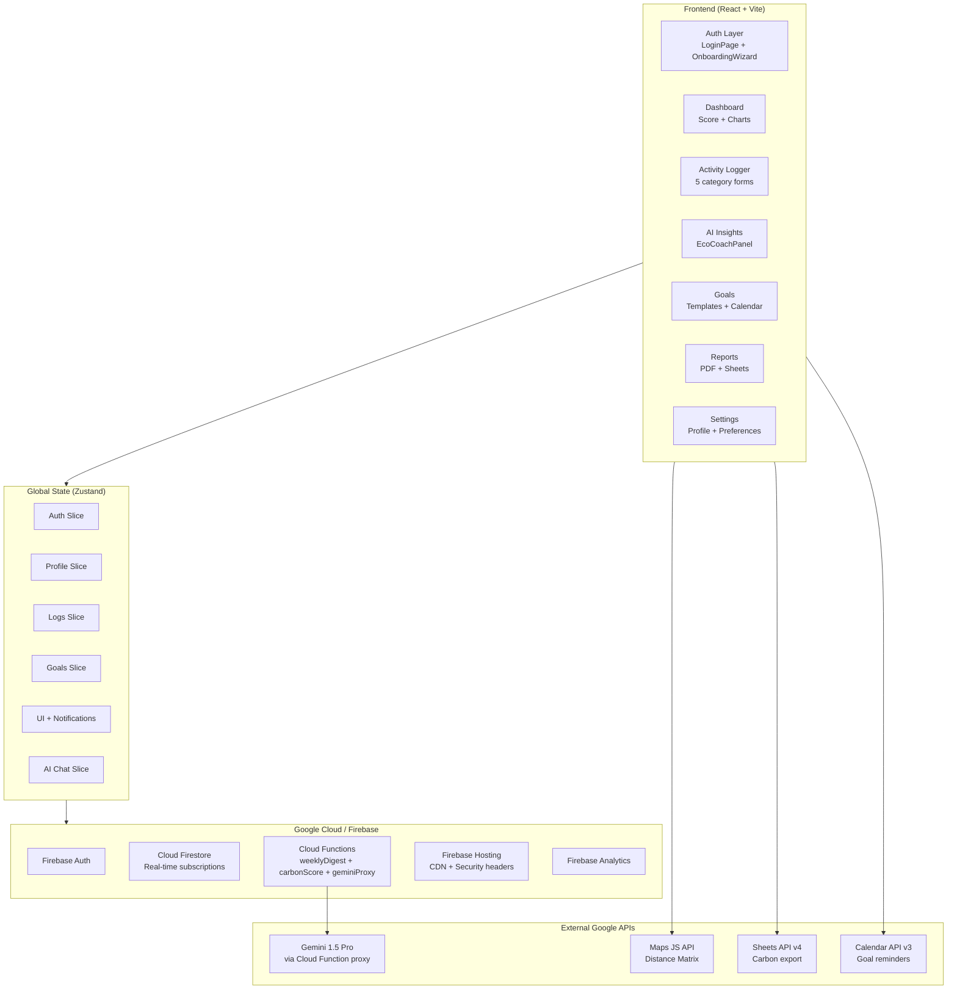

# 🌍 EcoTrack AI

> **Smart carbon footprint tracker** powered by Gemini AI, Firebase, and Google integrations.
> Track, understand, and reduce your environmental impact with personalised AI coaching.

## 📝 Project Design & Implementation Details

- **Chosen Vertical**: Consumer sustainability, personal carbon tracking, and AI-assisted carbon reduction coaching.
- **Approach & Logic**: Built as a React 18 + TypeScript SPA, the application uses Zod for real-time input validation and reactive calculators. Global state is managed using Zustand slice stores. The design prioritizes decoupling client logic from database initialization: if Firebase API credentials are unset or placeholders, the app automatically activates a fully functional offline-first **Demo Mode** with reactive in-memory state stores, allowing users to test forms, view charts, and interact with the AI without backend failures.
- **How the Solution Works**:
  - *Activity Logging*: Five modular forms take user inputs (e.g., travel km, utility bills, food consumption) and calculate emission values dynamically.
  - *Google Integrations*: Includes route calculations using Google Maps Distance Matrix API, reminder synchronizations via Google Calendar API, and structured CSV exports via Google Sheets API.
  - *AI Coaching (EcoCoach)*: Feeds the user's current metrics, target goals, and local grid constraints to a server-side Gemini 1.5 model via a rate-limited Cloud Functions proxy.
- **Assumptions Made**:
  - Annual projections are computed by multiplying the user's daily emission average by 365.
  - Baseline food carbon footprints assume standard portion sizes and average agricultural yields.
  - Flight calculations apply a 1.9x Radiative Forcing Index (RFI) multiplier to reflect the true environmental impact of high-altitude greenhouse emissions.

[](https://www.typescriptlang.org/)
[](https://react.dev/)
[](https://firebase.google.com/)
[](https://vitejs.dev/)
[](https://tailwindcss.com/)

---

## ✨ Features

| Feature | Description |
|---|---|
| 🔐 **Firebase Auth** | Google Sign-In with 1-click onboarding |
| 📊 **Dashboard** | Real-time score ring, trends, and comparison to 1.5°C target |
| ✏️ **Activity Logger** | Log transport, energy, food, shopping, and flights |
| 🤖 **Gemini AI Coach** | Streaming AI responses with personalised suggestions |
| 🎯 **Goals** | Goal templates, progress tracking, confetti celebrations |
| 📄 **Reports** | Monthly/quarterly/annual reports → Sheets, PDF, JSON |
| 📅 **Google Calendar** | Auto-create goal reminders |
| 🗺️ **Google Maps** | Route distance calculator in logger |
| ☁️ **Cloud Functions** | Weekly digest emails, carbon score computation, Sheets export |
| 🔒 **Security** | Strict Firestore rules, CSP headers, GDPR-compliant data deletion |
| ♿ **Accessibility** | WCAG 2.1 AA, keyboard navigation, skip links, ARIA roles |

---

## 🏗️ Architecture



---

## 🚀 Quick Start

### Prerequisites

- Node.js 20+
- Firebase CLI: `npm install -g firebase-tools`
- A Google Cloud / Firebase project

### 1. Clone and Install

```bash
git clone https://github.com/yourorg/ecotrack-ai.git
cd ecotrack-ai
npm install
```

### 2. Configure Environment

```bash
cp .env.example .env.local
# Fill in all VITE_* variables from Firebase Console and Google Cloud Console
```

#### Required API Keys

| Variable | Where to get it |
|---|---|
| `VITE_FIREBASE_*` | Firebase Console → Project Settings → Your Apps |
| `VITE_GOOGLE_MAPS_API_KEY` | Cloud Console → Credentials (restrict to Maps JS API + Distance Matrix API) |
| `VITE_GEMINI_PROXY_URL` | Your deployed Cloud Function URL |
| `GEMINI_API_KEY` | Google AI Studio → API Keys (server-side only!) |
| `SENDGRID_API_KEY` | SendGrid → Settings → API Keys |

### 3. Enable Google APIs

In [Google Cloud Console](https://console.cloud.google.com/apis/library):

- ✅ Maps JavaScript API
- ✅ Distance Matrix API
- ✅ Places API
- ✅ Google Sheets API
- ✅ Google Calendar API
- ✅ Generative Language API (Gemini)

### 4. Run Locally

```bash
npm run dev
# App runs at http://localhost:5173

# In a separate terminal, run Firebase Emulators:
firebase emulators:start
# Emulator UI at http://localhost:4000
```

### 5. Deploy to Firebase

```bash
# Build frontend
npm run build

# Deploy everything (hosting + functions + firestore rules)
firebase deploy

# Deploy only hosting
firebase deploy --only hosting

# Deploy only Cloud Functions
firebase deploy --only functions
```

---

## 🧪 Testing

### Unit Tests (Vitest)

```bash
# Run all unit tests
npm test

# Watch mode
npm run test:watch

# Coverage report (opens in browser)
npm run test:coverage

# Interactive UI
npm run test:ui
```

**Coverage targets:** 80% lines/functions, 70% branches

### E2E Tests (Playwright)

```bash
# Install Playwright browsers (first time)
npx playwright install

# Run all E2E tests
npm run test:e2e

# Interactive UI mode
npm run test:e2e:ui

# Run a specific test file
npx playwright test tests/e2e/app.spec.ts
```

**E2E test coverage:**
1. Complete onboarding flow (4 steps)
2. Log transport activity
3. AI coach responds to questions
4. Export to reports page
5. Keyboard-only navigation
6. Dark mode persistence
7. Goal creation
8. Accessibility focus rings

---

## 📁 Project Structure

```
ecotrack-ai/
├── src/
│   ├── components/
│   │   ├── auth/          # LoginPage, OnboardingWizard
│   │   ├── charts/        # WeeklyBarChart, CategoryDonutChart, TrendLineChart
│   │   ├── dashboard/     # Dashboard, Sidebar
│   │   ├── goals/         # GoalsPage
│   │   ├── insights/      # EcoCoachPanel (Gemini chat)
│   │   ├── maps/          # MapDistanceModal
│   │   ├── reports/       # ReportsPage
│   │   ├── settings/      # SettingsPage
│   │   └── shared/        # Button, Card, ScoreRing, Toggle, Slider...
│   ├── constants/
│   │   └── emissionFactors.ts  # IPCC AR6 + DEFRA 2023 data
│   ├── hooks/
│   │   ├── useAuth.ts     # Firebase auth listener
│   │   └── useCarbonData.ts # Aggregated carbon metrics
│   ├── services/
│   │   ├── firebase.ts    # Firebase initialization
│   │   ├── firestore.ts   # CRUD + realtime subscriptions
│   │   ├── gemini.ts      # AI service + streaming
│   │   ├── maps.ts        # Distance Matrix API
│   │   ├── sheets.ts      # Sheets export
│   │   └── calendar.ts    # Calendar event creation
│   ├── store/
│   │   └── index.ts       # Zustand store slices
│   ├── types/
│   │   └── index.ts       # All TypeScript interfaces
│   └── utils/
│       ├── carbonCalc.ts  # IPCC/DEFRA calculation engine
│       └── validators.ts  # Zod schemas
├── functions/
│   ├── weeklyDigest.ts    # Scheduled email digest
│   ├── carbonScore.ts     # Real-time score computation
│   └── sheetsExport.ts    # Gemini proxy + Sheets export
├── tests/
│   ├── e2e/               # Playwright tests
│   ├── unit/              # Vitest tests
│   └── setup.ts           # Test configuration
├── public/
│   └── manifest.json      # PWA manifest
├── firestore.rules        # Security rules
├── firestore.indexes.json # Composite indexes
├── firebase.json          # Hosting + Functions config
├── vite.config.ts
├── vitest.config.ts
├── playwright.config.ts
└── tsconfig.json
```

---

## 🔬 Carbon Calculation Methodology

EcoTrack AI uses peer-reviewed emission factors from:

- **IPCC AR6 (2021)** — Baseline GWP100 factors
- **DEFRA 2023** — UK emission factor dataset
- **EU ETS 2023** — European grid intensity data

| Category | Method |
|---|---|
| 🚗 Transport | Mode × distance × fuel-specific EF (gCO₂e/km) |
| 🏠 Energy | kWh × grid intensity factor (by country) ÷ occupants |
| 🍔 Food | Diet type baseline EF × meals × waste × local/organic modifiers |
| 🛍️ Shopping | Item count × lifecycle EF + spend × generalised factor |
| ✈️ Flights | Distance × cabin class EF × Radiative Forcing Index (1.9×) |

> ⚠️ **All figures are estimates.** Carbon calculation carries inherent uncertainty. EcoTrack AI uses best-available published data and discloses the source for every calculation.

---

## 🔒 Security

- **Firestore rules** — Owner-only access, server-side field validation
- **Content Security Policy** — Strict CSP headers prevent XSS
- **HSTS** — Enforced HTTPS with preload
- **Gemini API key** — Server-side only (never exposed to browser)
- **Rate limiting** — 20 AI queries/day per user
- **GDPR** — Right to erasure (Article 17) implemented in Settings

---

## ♿ Accessibility

- WCAG 2.1 AA compliant
- Skip-to-content link on all pages
- All interactive elements keyboard-navigable
- ARIA roles: `role="main"`, `role="navigation"`, `role="log"`, `role="alert"`, `role="tablist"`, `role="switch"`
- Focus rings visible (3px, `#40916C`)
- Accessible charts include `role="img"` + `aria-label` + hidden data tables
- `prefers-reduced-motion` respected — all animations disabled
- Color is never the sole indicator of meaning

---

## 📄 License

MIT © 2025 EcoTrack AI Team

---

*Built with 💚 for a sustainable future.*
